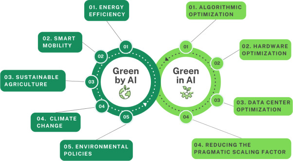
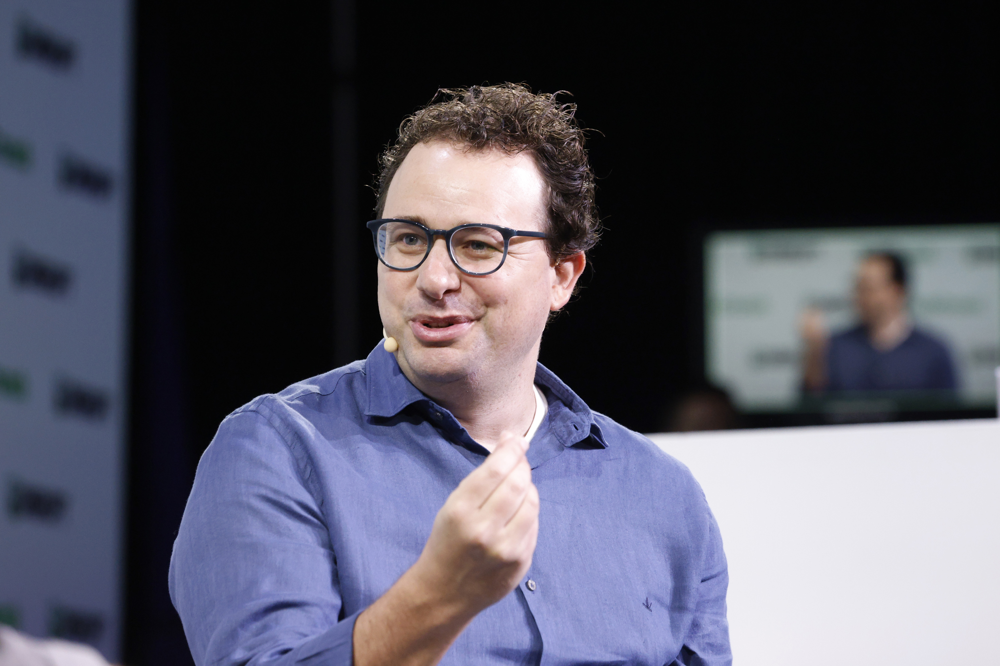
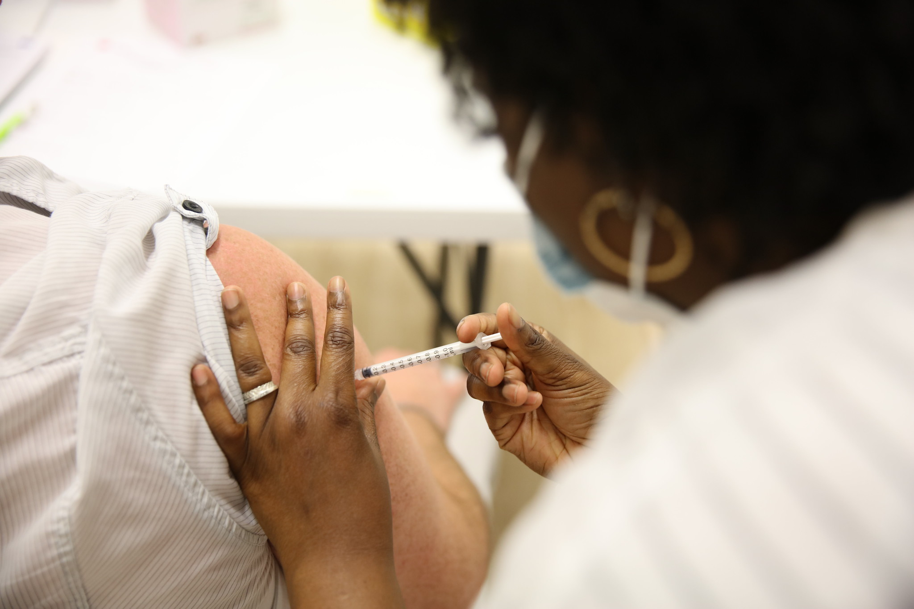

## Contexte

Le format prévu est de dix minutes de présentation suivies de vingt minutes de
discussion ; ce texte en est la version écrite, structurée pour être lue et
diffusée de façon autonome — le support de présentation (ODP) reste
volontairement plus visuel et minimaliste, une slide par idée.

Nous sommes déjà bien formés aux notions de RAG, de ReAct et de tool calling.
Je ne les réexplique pas ici. Le sujet de cette veille n'est pas technique au
sens de « comment fonctionne un agent », mais plus large : jusqu'où peut aller
le paradigme actuel des LLM, et quelle place reste-t-il aux autres formes
d'IA ?

## Rappel : l'IA ne se résume jamais à une seule catégorie

Dans une veille précédente, nous avions vu qu'il fallait décomposer le mot
« IA » selon ses usages et ses impacts : AI for Brown, AI for Green, Green AI
— trois réalités très différentes derrière un même terme. Aujourd'hui, je
montre un des domaines de l'IA positive : la médecine.

## Une prédiction, trois cas, un fil rouge

Une prédiction et trois cas structurent cette veille, dans un ordre qui suit
la **chronologie réelle des idées et des expérimentations**, pas la date de
parution des articles de presse qui m'y ont menée. Dario Amodei ouvre le
propos comme point de départ prospectif ; les trois cas qui suivent le
confrontent, chacun à sa façon, à des réalisations effectives :

- **Octobre 2024 — Dario Amodei** publie *Machines of Loving Grace*, une
  vision prospective : c'est le point de départ, pas un cas médical.

1. **Décembre 2024 — le préprint o1-preview** est déposé ; sa publication
   finale dans *Science* n'arrivera qu'en avril 2026.
2. **Août 2026 — Claude/Mythos** conçoit des protéines de façon largement
   autonome.
3. **Août 2026 — une étude sur la prédiction de la réponse vaccinale** sert
   de contrepoint : une IA spécialisée, sans LLM.

Le fil rouge : nous nous formons à l'IA agentique, mais l'actualité médicale
montre à la fois la puissance croissante des LLM utilisés seuls, l'apparition
de systèmes scientifiques authentiquement agentiques, et la persistance
d'autres paradigmes d'IA.

## Dario Amodei : la prédiction

Dario Amodei est cofondateur et CEO d'Anthropic, l'entreprise derrière Claude,
et ancien d'OpenAI. En octobre 2024, dans son essai *Machines of Loving
Grace*, il avance une hypothèse radicale : une « powerful AI » — qu'il décrit
comme un « **country of geniuses in a datacenter** », capable de surpasser des
lauréats Nobel, de travailler de façon autonome pendant des semaines et
d'exister en millions de copies parallèles — pourrait condenser plusieurs
décennies de progrès médical en quelques années.

Sa prédiction centrale : *« AI-enabled biology and medicine will allow us to
compress the progress that human biologists would have achieved over the next
50-100 years into 5-10 years »*. À cet horizon, il annonce le traitement de la
quasi-totalité des maladies infectieuses, l'élimination de plus de 95 % des
cancers, la résolution d'Alzheimer et un doublement de l'espérance de vie. Son
raisonnement : l'essentiel du progrès biologique vient d'une poignée de
« découvertes-outils » par an — CRISPR, vaccins ARNm, séquençage — dont le
facteur limitant serait l'ingéniosité disponible, pas le financement.

Le point technique qui m'intéresse le plus : Amodei ne postule **pas** un
paradigme différent des LLM actuels. Sa « powerful AI » reste dans la
continuité du paradigme présent — scaling, post-training, outils, capacité
d'action, parallélisation massive. Ce qui change, c'est l'échelle et
l'autonomie, pas la nature du mécanisme.

Il serait malhonnête de présenter cette prédiction sans ses propres réserves.
Amodei écrit lui-même : *« Everything I'm saying could very easily be wrong
(...) all of this is unavoidably going to consist of guesses »*, et son
calendrier de 5 à 10 ans *« is not based on any rigorous methodology »*. Ce
que je présente ici est une prospective, pas un résultat.

D'où la question qui structure la suite : est-ce seulement une prédiction
spectaculaire d'un dirigeant de l'IA, ou voit-on déjà des indices allant dans
cette direction ?

## o1-preview : ce que le modèle seul sait déjà faire

Le travail sur o1-preview est bien antérieur à sa publication finale. Le
préprint, déposé en décembre 2024, s'intitulait *« **Superhuman** performance
of a large language model on the reasoning tasks of a physician »* ; la
version parue dans *Science* en avril 2026 a perdu ce mot dans son titre — il
survit dans le corps du texte. Premier indice de la prudence progressive du
langage scientifique face à la formulation médiatique.

Deux versions du modèle apparaissent selon les expériences, à ne pas
confondre : **o1-preview** sur les vignettes cliniques, comparé à GPT-4 et à
des cliniciens ; **o1** dans l'étude en conditions réelles, comparé à GPT-4o
et à deux médecins seniors sur **79 cas** aux urgences d'un centre
hospitalo-universitaire de Boston, notés en aveugle sur l'échelle de Bond.

Le résultat le plus solide porte sur le **raisonnement probabiliste** :
estimer la probabilité d'une maladie avant et après un test. o1-preview y est
comparé à GPT-4 et à **553 cliniciens humains**, par l'erreur absolue moyenne
face à une fourchette de référence issue de la littérature. Sur l'ischémie
cardiaque après test positif, cette erreur est de **5,7 pour o1-preview,
contre 56,5 pour GPT-4 et 56,3 pour les cliniciens**. Sur plusieurs
scénarios, le modèle est donc mieux calibré que les médecins eux-mêmes — c'est
ce qui donne un contenu vérifiable au mot « superhuman », au-delà de la
formule.

Mais la performance n'est pas uniforme. Sur la génération de plans d'examens
complémentaires, trois cas sont publiés en illustration : un score parfait,
un score partiel, et un **score nul** — une liste de dix-sept examens jugée
inutile pour le cas concerné. Un exemple sur trois est un échec net.

Aucune source consultée ne mentionne de RAG médical, de fine-tuning dédié ni
de boucle d'outils : l'architecture semble être `dossier clinique → prompt →
modèle → diagnostic`, sans dispositif supplémentaire. Je le formule avec
prudence — l'absence de mention n'est pas une confirmation. Les auteurs
appellent eux-mêmes à des essais prospectifs, et l'étude reste américaine,
hors cadre RGPD, sur des cas textuels : le modèle n'examine physiquement
aucun patient.

Si un modèle de raisonnement seul atteint déjà ce niveau, la question est
directe : à quel moment le harness, le RAG et l'agentification deviennent-ils
réellement nécessaires — et sur quelles tâches, puisque le plan d'examens
reste un point faible ?

## Claude et Mythos : quand le système devient réellement agentique

Après le modèle seul, une expérience beaucoup plus proche de la trajectoire
imaginée par Amodei. Dans les travaux de conception de protéines publiés par
Anthropic le 18 août 2026, ce n'est pas un Claude public ordinaire qui
intervient, mais **Mythos Preview** et **Opus 4.8** pour la conception, et
**Opus 5** pour l'analyse chimique — distinction à garder à l'esprit : aucun
abonnement grand public ne reproduit ce dispositif.

Le système dispose de modèles de conception protéique open source, de modèles
de folding, d'un accès internet, d'un corpus scientifique et surtout d'une
infrastructure de calcul considérable : jusqu'à **12 500 heures de GPU NVIDIA
H100**. Claude a opéré de façon autonome, en 48 heures contre quinze cibles
simultanées ou en 24 heures par cible, orchestrant lui-même la sélection des
sites de liaison, la génération de structures, l'optimisation sur plusieurs
cycles et le criblage.

Les chiffres : 1 320 designs testés, un taux de succès de 26,7 % en
multi-cibles et **35,1 %** en mono-cible — contre 10 à 15 % pour la norme
actuelle du domaine. Au total, **354 binders confirmés** contre quatorze des
quinze cibles. Deux partenaires indépendants, Adaptyv Bio et Twist
Bioscience, les ont produits et testés en laboratoire humide : la validation
ne s'arrête pas au numérique.

Anthropic pose elle-même les limites : certaines cibles sont restées
difficiles, et surtout un binder à haute affinité n'est qu'une **première
étape** vers un médicament — en aucun cas le « médicament prêt à l'emploi »
que certains titres de presse ont annoncé.

Ce qui compte ici n'est pas qu'un LLM « sache tout », mais qu'il devienne un
**orchestrateur** de modèles spécialisés, d'outils et de calcul, capable
d'itérer seul pendant des dizaines d'heures et de produire un résultat qui
sort du numérique pour être testé physiquement. Une matérialisation
embryonnaire de la vision d'Amodei — pas une preuve.

## Vaccination : le contre-pied, l'IA non-LLM existe toujours

Après le modèle seul, puis le système agentique, un contre-exemple
volontaire. L'étude parue le 20 août 2026 sur la prédiction de la réponse
vaccinale n'est **ni un LLM, ni un agent, ni du RAG** : c'est un modèle de
deep learning spécialisé, qui analyse les motifs d'un panel d'anticorps pour
construire un profil immunitaire.

Les données : 8 687 échantillons sanguins de 4 089 participants, avec mesure
d'anticorps contre 185 antigènes, sur une population mêlant volontaires sains
et patients immunosupprimés. Le modèle prédit, **avant l'injection**, la force
de la réponse immunitaire attendue au vaccin COVID-19.

Le résultat marquant n'est pas celui qu'on attend : si les patients
immunosupprimés répondent faiblement, sans surprise, **5 à 6 % des
participants en bonne santé** aussi — un cas contre-intuitif que le modèle
permet désormais d'anticiper plutôt que de constater après coup.

La mode actuelle pousse à l'équation « IA = LLM = agent ». Ce cas montre
qu'elle est fausse : pour un problème de prédiction bien défini sur des
données structurées, un modèle spécialisé reste plus naturel qu'un LLM. Ces
approches n'ont pas disparu avec l'essor des modèles de langage.

## Dézoom : plusieurs IA coexistent

La chronologie n'est pas celle d'une succession — ancienne IA, puis LLM, puis
agents, puis disparition du reste. En 2026, plusieurs familles coexistent :

- **o1 / o1-preview** : un LLM généraliste de raisonnement, utilisé presque
  seul, déjà mieux calibré que des cliniciens sur le raisonnement
  probabiliste — mais irrégulier sur d'autres tâches.
- **Claude / Mythos** : un LLM au centre d'un système agentique, qui orchestre
  outils, calcul et modèles spécialisés, validé physiquement en laboratoire.
- **Le modèle vaccinal** : du deep learning spécialisé, sans aucun LLM,
  pertinent parce que le problème est bien défini et les données structurées.
- **Amodei** : une prospective qui extrapole très loin — assumée par son
  auteur comme une série de « guesses ».

## Apports sur mes pratiques

Deux choses changent concrètement dans la façon dont j'aborde une
architecture, QualiCheck compris.

**La question de conception se déplace du modèle vers le système.** Ce ne sont
pas 354 binders validés qui viennent d'un LLM plus gros, mais d'une
orchestration : modèles de folding spécialisés, calcul dédié, itération
autonome, validation externe indépendante. Ma question de départ n'est donc
plus « quel modèle choisir », mais « quel système autour du modèle » — quels
outils, quelle boucle, quelle validation, et par qui.

**Le choix du paradigme devient une décision à justifier, pas un réflexe.**
Avant de router un traitement vers un LLM, la question est maintenant : est-ce
que le problème est assez bien défini et les données assez structurées pour
qu'un modèle spécialisé fasse mieux ? Le cas vaccinal montre que la réponse
est parfois oui — et c'est là que le fil du début se referme : un modèle
spécialisé sur une tâche bien posée consomme nettement moins qu'un LLM
généraliste. Le réflexe « agentique par défaut » a donc un coût
environnemental, pas seulement financier. C'est exactement l'angle Green AI
du rappel initial, appliqué à une décision d'architecture concrète.

## Conclusion et question ouverte

Le futur n'est probablement pas tout LLM. Il peut être composé de modèles
généralistes pour raisonner et orchestrer, de modèles spécialisés pour
prédire, d'outils, d'humains et du monde physique — les laboratoires qui
testent réellement les protéines de Mythos en sont le rappel concret.

Reste la question que je n'ai pas la prétention de trancher : jusqu'où le
paradigme actuel — Transformer, prédiction de tokens, scaling, post-training,
raisonnement à l'inférence, outils — peut-il aller avant qu'une rupture ne
devienne nécessaire ? Les cas présentés donnent des indices dans les deux
sens. On ne sait pas encore où se situe la limite, et c'est, je crois, la
réponse honnête.

## Méthode de veille

Cette veille est partie d'articles des Numériques — des points d'entrée, pas
les sources citées ici. En remontant leurs références, j'ai retrouvé à chaque
fois la publication originale : l'essai d'Amodei sur son site, le préprint
arXiv puis *Science* pour o1-preview, le rapport de recherche d'Anthropic pour
Mythos, la publication relayée par ASU News pour l'étude vaccinale. La chaîne
tient en une ligne : **article de presse → source institutionnelle →
publication originale**. Le détail des sources et de leur fiabilité figure
dans `sources_veille_ia_medecine.md`.

## Sources

### Dario Amodei

- [*Machines of Loving Grace*](https://darioamodei.com/essay/machines-of-loving-grace)
  (essai, octobre 2024)
- Point d'entrée : [Les Numériques — « L'IA pourra guérir la plupart des
  maladies humaines d'ici 5 à 10 ans »](https://www.lesnumeriques.com/intelligence-artificielle/l-ia-pourra-guerir-la-plupart-des-maladies-humaines-d-ici-5-a-10-ans-affirme-le-fondateur-de-claude-n260487.html)

### o1-preview

- [Préprint](https://arxiv.org/abs/2412.10849) (arXiv, décembre 2024)
- [Publication *Science*](https://doi.org/10.1126/science.adz4433)
  (30 avril 2026)
- Point d'entrée : [Les Numériques — « Une IA a été testée sur de vrais
  patients aux urgences : elle a surpassé les
  médecins »](https://www.lesnumeriques.com/intelligence-artificielle/une-ia-a-ete-testee-sur-de-vrais-patients-aux-urgences-elle-a-surpasse-les-medecins-n255425.html)

### Claude / Mythos

- [*Claude accelerates protein design*](https://www.anthropic.com/research/Claude-accelerates-protein-design)
  (Anthropic, 18 août 2026)
- Point d'entrée : [Les Numériques — « Un espoir pour des millions de malades
  chroniques : une IA a conçu des molécules de médicaments en 48
  heures »](https://www.lesnumeriques.com/intelligence-artificielle/un-espoir-pour-des-millions-de-malades-chroniques-une-ia-a-concu-des-molecules-de-medicaments-en-48-heures-n260621.html)

### Vaccination

- [*Why immune responses to vaccines vary from person to person*](https://news.asu.edu/20260820-science-and-technology-why-immune-responses-vaccines-vary-person-person)
  (ASU News, 20 août 2026)
- [Publication *Cell Press Blue*](https://doi.org/10.1016/j.cpblue.2026.100088)
- Point d'entrée : [Les Numériques — « Un vaccin fonctionnera-t-il chez
  vous ? Une IA peut désormais le
  savoir »](https://www.lesnumeriques.com/intelligence-artificielle/un-vaccin-fonctionnera-t-il-chez-vous-une-ia-peut-desormais-le-savoir-n260705.html)

Justification détaillée de la fiabilité de chaque source (auteur, nature
institutionnelle ou académique, date) : `sources_veille_ia_medecine.md`.
